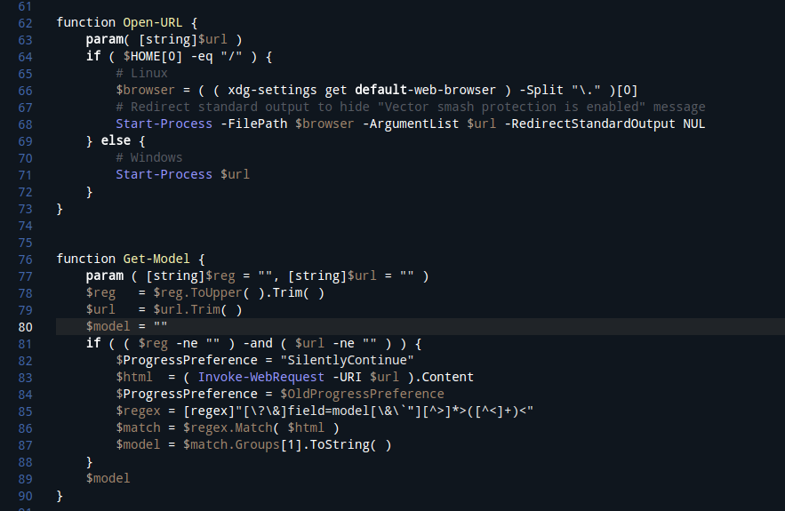

# Blueberry theme




## Install Linux
```
cd ~/.vscode-oss/extensions
git clone https://github.com/dwrolvink/vscode-blueberry-theme.git
```
In VSCode:
 - F1; Reload Window
 - F1; Preferences: Color theme; select blueberry
 
## Install Windows
Same as above, bit the extensions folder is located elsewhere

## Information about the screenshot
User settings for this screenshot
```
{
    "editor.fontFamily": "'SourceCodePro', 'Droid Sans Mono', 'monospace', monospace, 'Droid Sans Fallback'",
    "workbench.colorTheme": "Blueberry-theme",
    "editor.renderIndentGuides": false
}
```

## Tip:
If you want to edit the theme:
 - Open ~/.vscode-oss/extensions/blueberry/themes/Blueberry-theme-color-theme.json
 - Use F1; "Developer: Inspect TM Scopes" to find the scope names of the element you want the color changed of.
 - Use F1; Reload Window to apply changes made to the theme
 
